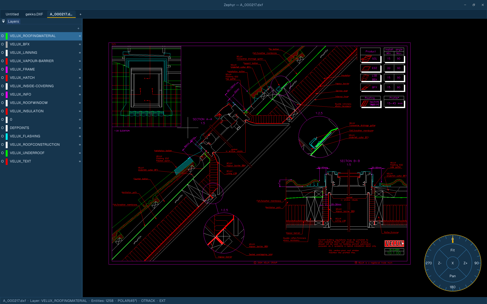

# Zephyr

**A native, GPU-accelerated 2D CAD application — free, open source, and built from scratch in Swift.**

Zephyr is a drafting app that runs natively on macOS (Metal) and Windows (Direct3D 12). It reads DWG and DXF, exports PDF with Bluebeam-compatible measurements, and is designed to replace QCAD/LibreCAD as the go-to free alternative to AutoCAD LT. No subscriptions, no telemetry, no Qt/OpenGL legacy stack.



## Tech Stack

| Layer | Technology |
|---|---|
| **Language** | Swift (~42k LOC) |
| **GPU (macOS)** | Metal via SDL3 |
| **GPU (Windows)** | Direct3D 12 via SDL3 |
| **UI** | ImGui (SDL3 GPU backend) |
| **DXF/DWG I/O** | libdxfrw C++ bridge |
| **PDF** | PDFium (Windows/Linux) · PDFKit (macOS) |
| **Compression** | zstd via zlib-ng |
| **Fonts** | SDL_ttf + custom SHX byte-code interpreter |
| **License** | GPL v2 — free to use, fork, and ship |

## Why Zephyr?

- **QCAD/LibreCAD replacement** — DXF parsing that actually works: MText formatting, SHX shape fonts, NURBS splines, dimension styles, and title blocks all render correctly. No raw escape codes leaking into labels, no scrambled curves, no missing logos.
- **AutoCAD LT alternative** — AutoCAD muscle memory preserved. `L`, `PL`, `C`, `REC`, `M`, `TR`, `J` all work. Command palette with fuzzy autocomplete, polar tracking, object snap tracking, grips, and a full snap engine.
- **GPU-native** — Metal on macOS, Direct3D 12 on Windows. Single Swift rendering pipeline. 120 FPS canvas with pixel-perfect GPU picking. No OpenGL emulation layer.
- **Free forever** — GPL v2. No account, no email gate, no subscription. ~14 MB download.

## Current Features

### File I/O
- **DWG import** — Full read via libdxfrw bridge. Blocks, layers, text styles, hatches, splines, polylines with bulge, dimensions.
- **DXF import/export** — R2007 round-trip. Dimensions, splines, hatches, leaders all preserved.
- **PDF export** — Vector PDF 1.7 with Bluebeam Revu-compatible Measurement dictionary.
- **PDF import** — PDFKit on macOS, PDFium on Windows.
- **EAB native format** — Fast binary save/load. zstd compression, BVH spatial index, viewport-culled partial loads.

### Drawing Commands
| Command | Alias | Description |
|---|---|---|
| LINE | `L` | Line segments |
| POLYLINE | `PL` | Multi-vertex polylines with arc segments |
| CIRCLE | `C` | Center-radius circles |
| ARC | `A` | 3-point arcs |
| RECTANGLE | `REC` | Axis-aligned rectangles |
| ELLIPSE | `EL` | Ellipses and elliptical arcs |
| HATCH | `H` | Boundary hatches with pattern fill |
| SPLINE | `SPL` | NURBS splines |
| RAY | `R` | Infinite construction rays |
| TEXT | `T` | Single-line and multi-line text |
| IMAGE | `IMG` | Raster image placement |
| PDFIMPORT | `PDFI` | PDF underlay import |

### Edit & Modify
| Command | Alias | Description |
|---|---|---|
| JOIN | `J` | Join collinear/contiguous entities |
| TRIM | `TR` | Trim to cutting edges |
| SPLINEEDIT | `SPE` | Edit spline control points |
| DDEDIT | `ED` | Edit text and attributes in-place |
| CLEANSPECKLES | `CS` | Sample-and-erase speckle artifacts from scanned drawings |
| MEASUREGEOM | `MEA` | Quick Measure — hover to raycast orthogonal distances |

### Tool Modes
SELECT, MOVE, ROTATE, SCALE, PAN, ZOOM

### Snap Engine
9 anchor types with two-tier filtering (AABB proximity → exact distance):
center, vertex, midpoint, insertion point, quadrant, nearest, perpendicular, tangent, intersection

### Tracking
- **Polar tracking** at 15°, 30°, 45°, 90° increments
- **Object snap tracking (OTRACK)** from acquired points
- **Extension snapping** along existing geometry

### Grips
Per-vertex grips on polylines and polygons. Corner, center, midpoint, and rotation grips on selection bounding boxes.

### Blocks
Block edit in-place (`BEDIT` / `BE`). SIMPLIFY swaps heavy blocks for bounding-box stand-ins during pan/zoom.

### Layers
Full layer table with ACI color indexing. Per-layer line type and weight. Layer move command (`LAYMOVE` / `LM`).

### Constraints (15 types)
Coincident, parallel, perpendicular, tangent, concentric, horizontal, vertical, equal, distance, angle, fix, midpoint, collinear, symmetric, offset. Numeric solver with cached transforms.

### SHX Shape Font Interpreter
Full byte-code interpreter for AutoCAD `.shx` shape fonts. Text renders as pure vectors at any zoom — no bitmap degradation.

### MText Parser
Full interpreter for DXF formatting codes — `%%u` (underline), `%%o` (overline), `%%d` (degree), `%%c` (diameter), `\P` (paragraph break), font/color/width stack changes. Attachment point, column width, and line spacing factor all honored.

### NURBS / Spline Evaluator
Adaptive subdivision keyed to screen pixels. Curves stay smooth at any zoom, bounded arcs stay bounded.

### UI
- **Command palette** — Press Space, type, Tab-cycle through fuzzy-matched autocomplete. 46+ registered commands.
- **Multi-drawing tabs** — Open multiple files, dirty-state tracking, unsaved-changes confirmation.
- **Draw palette** — Visual tool picker with categorized commands.
- **Layer panel** — Visibility toggles, color swatches, entity counts.
- **Properties panel** — Per-entity property editing.
- **Block panel** — Block library with preview.
- **Radial navigation** — Right-click radial menu for pan, zoom, fit.
- **Status bar** — Coordinates, snap mode indicators, entity count.

### Rendering Engine
- **Metal** (macOS) and **Direct3D 12** (Windows) via SDL3 GPU API
- **Multi-sample anti-aliasing** (MSAA)
- **GPU-based entity picking** — 9×9 pixel-perfect ID rendering
- **BVH spatial index** — Accelerated hit testing and viewport culling

### As-Built Tracking
Schema-based XData metadata system for tracking construction as-built conditions. Date-stamped attributes, layer-state snapshots.

## Nightly Builds

| Platform | Download |
|---|---|
| macOS (ARM64) | [EngineAsBuilt-macOS-arm64.zip](https://github.com/joseph-montanez/as-built/releases/download/nightly/EngineAsBuilt-macOS-arm64.zip) |
| Windows (x64) | [EngineAsBuilt-Windows-x64.zip](https://github.com/joseph-montanez/as-built/releases/download/nightly/EngineAsBuilt-Windows-x64.zip) |

**Requirements:** macOS 13+ (Apple silicon & Intel) · Windows 10+ (x64 & ARM64) · ~14 MB download

## Quick Start

```bash
# macOS
cd Engine/EngineAsBuilt
sh compile-macos.sh

# Windows (ARM64, via Visual Studio Native Tools)
cd Engine\EngineAsBuilt
.\compile.ps1
```

---

[Development Setup](DEVELOPMENT.md) · [Issues](https://github.com/joseph-montanez/as-built/issues)
